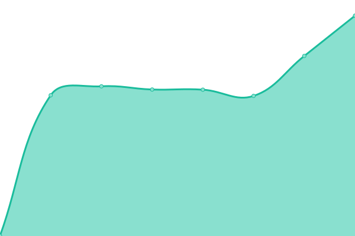

# [📈 Live Status](https://rdd-giga.github.io/reset-status-page): <!--live status--> **🟧 Partial outage**

This repository contains the open-source uptime monitor and status page for [GIGA](http://giga.build/), powered by [Upptime](https://github.com/upptime/upptime).

With [Upptime](https://upptime.js.org), you can get your own unlimited and free uptime monitor and status page, powered entirely by a GitHub repository. We use [Issues](https://github.com/rdd-giga/reset-status-page/issues) as incident reports, [Actions](https://github.com/rdd-giga/reset-status-page/actions) as uptime monitors, and [Pages](https://rdd-giga.github.io/reset-status-page) for the status page.

<!--start: status pages-->
<!-- This summary is generated by Upptime (https://github.com/upptime/upptime) -->
<!-- Do not edit this manually, your changes will be overwritten -->
<!-- prettier-ignore -->
| URL | Status | History | Response Time | Uptime |
| --- | ------ | ------- | ------------- | ------ |
|  [RESET Site](https://reset.build) | 🟩 Up | [reset-site.yml](https://github.com/rdd-giga/reset-status-page/commits/HEAD/history/reset-site.yml) | 

 1636ms
     
 | 

<a href="https://status.reset.build/history/reset-site">100.00%</a>
    

|  [RESET Assessment](https://assessment.reset.build) | 🟩 Up | [reset-assessment.yml](https://github.com/rdd-giga/reset-status-page/commits/HEAD/history/reset-assessment.yml) | 

 942ms
     
 | 

<a href="https://status.reset.build/history/reset-assessment">100.00%</a>
    

|  [RESET Cloud](https://cloud.reset.build) | 🟩 Up | [reset-cloud.yml](https://github.com/rdd-giga/reset-status-page/commits/HEAD/history/reset-cloud.yml) | 

 864ms
     
 | 

<a href="https://status.reset.build/history/reset-cloud">100.00%</a>
    

|  [RESET Socket API](https://reset.build) | 🟥 Down | [reset-socket-api.yml](https://github.com/rdd-giga/reset-status-page/commits/HEAD/history/reset-socket-api.yml) | 

 0ms
     
 | 

<a href="https://status.reset.build/history/reset-socket-api">0.00%</a>
    

<!--end: status pages-->

[**Visit our status website →**](https://rdd-giga.github.io/reset-status-page)

## 📄 License

- Powered by: [Upptime](https://github.com/upptime/upptime)
- Code: [MIT](./LICENSE) © [GIGA](http://giga.build/)
- Data in the `./history` directory: [Open Database License](https://opendatacommons.org/licenses/odbl/1-0/)
